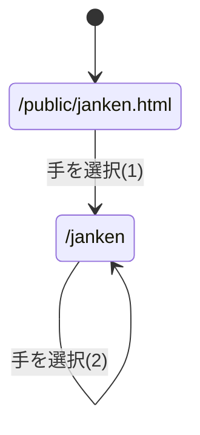
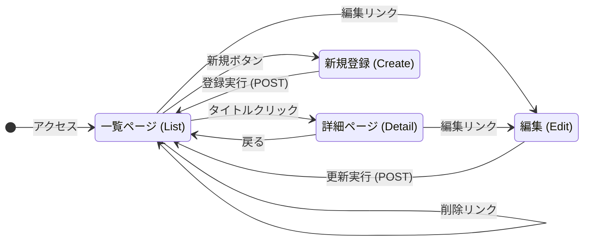

# webpro_06のページ遷移図

### じゃんけん関係
#### ページ遷移図

#### (1)のパラメータ

パラメータ名 | 属性 | 内容 | 値
-|-|-|-
hand | text | ユーザの手 | グー/チョキ/パー
win | hidden | 勝利数 | 0
total | hidden | 対戦数 | 0

#### (2)のパラメータ

パラメータ名 | 属性 | 内容 | 値
-|-|-|-
hand | text | ユーザの手 | グー/チョキ/パー
win | hidden | 勝利数 | これまでの勝利数
total | hidden | 対戦数 | これまでの対戦数

